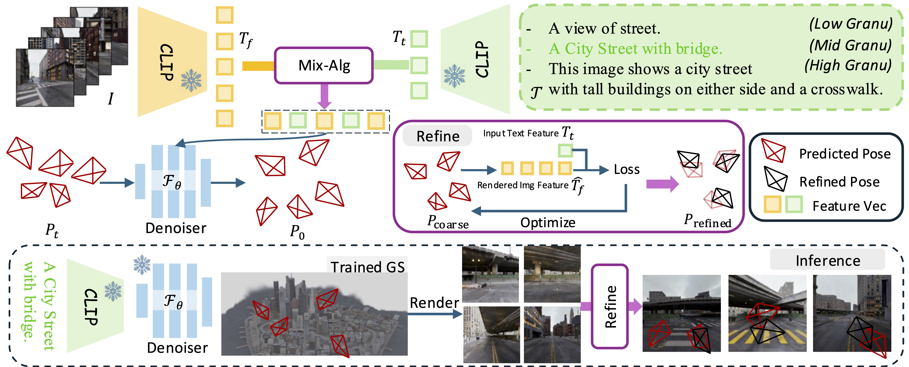

# CityLoc: Diffusion + CLIP + 3DGS

    

The offical implementation of our work: <strong>CityLoc: 6DoF Pose Distributional Localization for Text Descriptions in Large-Scale Scenes with Gaussian Representation</strong>.

#### $^\star$[Qi Ma](https://qimaqi.github.io/)1,2, $^\star$[Runyi Yang](https://runyiyang.github.io/)2, $^\dagger$[Bin Ren](https://amazingren.github.io/)2,3,4, [Nicu Sebe](https://scholar.google.com/citations?user=stFCYOAAAAAJ&hl=en)4, [Ender Konukoglu](https://people.ee.ethz.ch/~kender/) 1, [Luc Van Gool ](https://scholar.google.com/citations?user=TwMib_QAAAAJ&hl=en)1,2, and [Danda Pani Paudel](https://scholar.google.com/citations?user=W43pvPkAAAAJ&hl=en)1,2 
$^\star$: Equal Contribution, $^\dagger$: Corresponding Author  

1 ETH Zürich, Switzerland  
2 INSAIT Sofia University “St. Kliment Ohridski”, Bulgaria  
3 University of Pisa, Italy  
4 University of Trento, Italy  

<!--  -->
<!--  -->

## News
- [x] `03.02.2025`: The [Project Page](https://runyiyang.github.io/projects/cityloc/) is released!
- [x] `03.02.2025`: The Paper is released on [Arxiv](https://arxiv.org/abs/2501.08982).

## Citation

If you find our work helpful, please consider citing the following papers and/or ⭐ our repo.

<pre>
<code>
@misc{ma2025cityloc,
      title={CityLoc: 6DoF Pose Distributional Localization for Text Descriptions in Large-Scale Scenes with Gaussian Representation},
      author={Ma, Qi and Yang, Runyi and Ren, Bin and Sebe, Nicu and Konukoglu, Ender and Van Gool, Luc and Paudel, Danda Pani},
      journal={arXiv preprint arXiv:2501.08982},
      year={2025}
    }
</code>
</pre>

